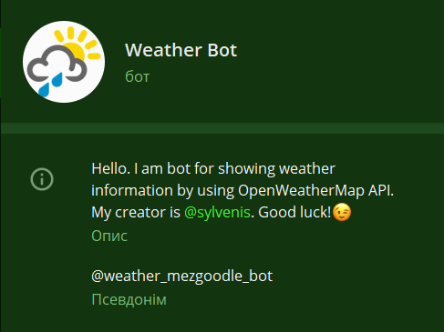
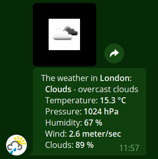

# Weather bot

Hi! This is the bot in Telegram for showing **weather information**. Built on Node.js.

## Motivation

I used to work with [OpenWeatherMap API](https://openweathermap.org/). It was in a projects with *React* and *Django*. Later I decided to make a bot that would show actual weather anywhere. My eye immediately fell on [Telegram](https://telegram.org/) as it is a beautiful eco system with a good one *API*. I chose the engine *Node.js* because I wanted to practice more with it.

## Build status


## Code style

[](https://www.codacy.com/manual/mezgoodle/weather-bot?utm_source=github.com&amp;utm_medium=referral&amp;utm_content=mezgoodle/weather-bot&amp;utm_campaign=Badge_Grade)

## Scrennshots





## Tech/framework used

**Built with**
 - [Node.js](https://nodejs.org/uk/)
 - [node-telegram-bot-api](https://www.npmjs.com/package/node-telegram-bot-api)
 - [axios](https://www.npmjs.com/package/axios)

## Features

With this bot you can find detailed information about the weather situation anywhere. Anyone can take this project as an example and improve it

## Code Example

 - Importing libraries

```js
const TelegramBot = require("node-telegram-bot-api");
const axios = require("axios");
```

 - Main function

```js
// Function that gets the weather by the city name
const getWeather = (chatId, city) => {
    const endpoint = weatherEndpoint(city);

    axios.get(endpoint).then((resp) => {
        const {
            name,
            main,
            weather,
            wind,
            clouds
        } = resp.data;

        bot.sendPhoto(chatId, weatherIcon(weather[0].icon));
        bot.sendMessage(
            chatId,
            weatherHTMLTemplate(name, main, weather[0], wind, clouds), {
                parse_mode: "HTML"
            }
        );
    }, (error) => {
        console.log("error", error);
        bot.sendMessage(
            chatId,
            `Ooops...I couldn't be able to get weather for <b>${city}</b>`, {
                parse_mode: "HTML"
            }
        );
    });
};
```

## Installation

1. Clone this repository

```bash
git clone https://github.com/mezgoodle/weather-bot.git
```

2. Use the package manager [npm](http://www.npmjs.com/) to install dependencies.

```bash
npm install
```

3. Insert your Telegram bot token and OpenWeatherMap api_key in [index.js](https://github.com/mezgoodle/weather-bot/blob/master/index.js#L5) like:

```js
const token = "YOUR_TELEGRAM_BOT_TOKEN";
const api_key = "YOUR API_KEY HERE";
```

## API Reference

Here I am using two main API services:
 - [Telegram Bot API](https://core.telegram.org/bots/api)
 - [Weather API](https://openweathermap.org/api)

## How to use?

If you have Telegram account, click [here](https://t.me/weather_mezgoodle_bot) to open chat with bot.

## Contribute

Pull requests are welcome. For major changes, please open an issue first to discuss what you would like to change.

## Credits

Repo which inspired me to build this project:
 - https://github.com/VGhostPro/weather_telegram_bot
 - https://github.com/yagop/node-telegram-bot-api

## Contact

If you have questions write me here: 
  *   [Telegram](https://t.me/sylvenis)
  *   [Gmail](mailto:mezgoodle@gmail.com)
  *   [Facebook](https://www.facebook.com/profile.php?id=100005721694357)

## License


MIT © [mezgoodle](https://github.com/mezgoodle)