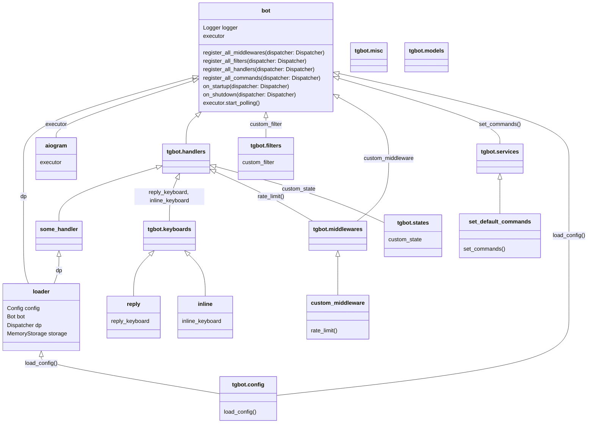

# bot_template
My template for aiogram bots

<h1 id="project-title" align="center">
  bot_template <br>
  
  
  
  
  
  
</h1>

<p align="center">
 🌟Hello everyone! This is the template for developing Telegram bots on Python with aiogram.🌟
</p>

## Motivation :exclamation:

When I was developing [Telegramia](https://github.com/mezidia/telegramia), I've used these templates: [aiogram-bot-template](https://github.com/Latand/aiogram-bot-template) and [tgbot_template](https://github.com/Latand/tgbot_template) for creating bots. And I have many probles with them. So I decided to create my own template.

## Diagram

Here you can understand how template works and what is imported from where.



## Examples

- [genji-moderator](https://github.com/mezgoodle/genji-moderator)
- [Telegramia](https://github.com/mezidia/Telegramia)

## Installation :computer:

1. Clone the repository

```bash
git clone https://github.com/mezgoodle/bot_template.git
```

2. Install dependencies

```bash
pip install -r requirements.txt
```

## Fast usage :dash:

1. Set the bot token in the tgbot.config.py file

2. Run the bot

```bash
python bot.py
```

## Contribute :running:

Pull requests are welcome. For major changes, please open an issue first to discuss what you would like to change.

## Credits :cat::handshake:

- [aiogram-bot-template](https://github.com/Latand/aiogram-bot-template)
- [tgbot_template](https://github.com/Latand/tgbot_template)

## License :bookmark:

MIT © [mezgoodle](https://github.com/mezgoodle)
